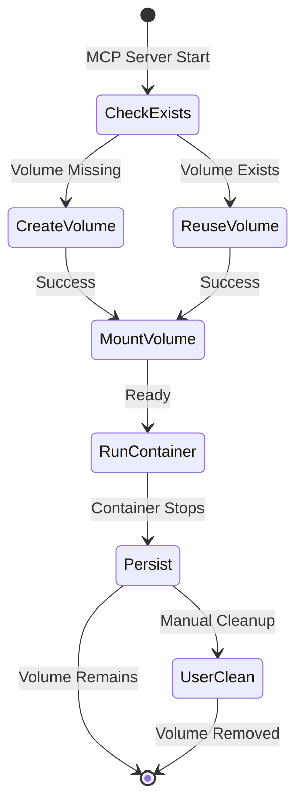
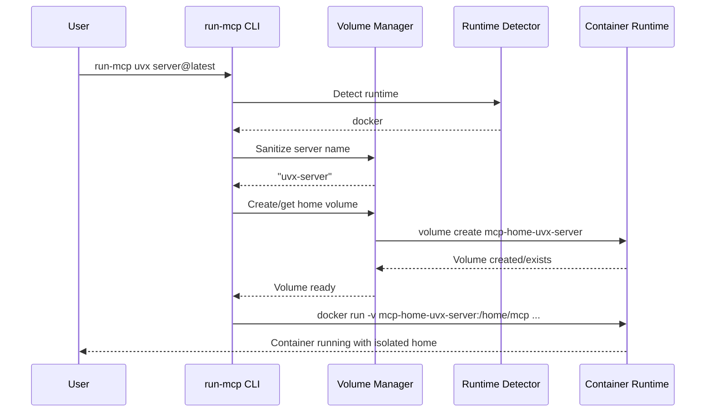
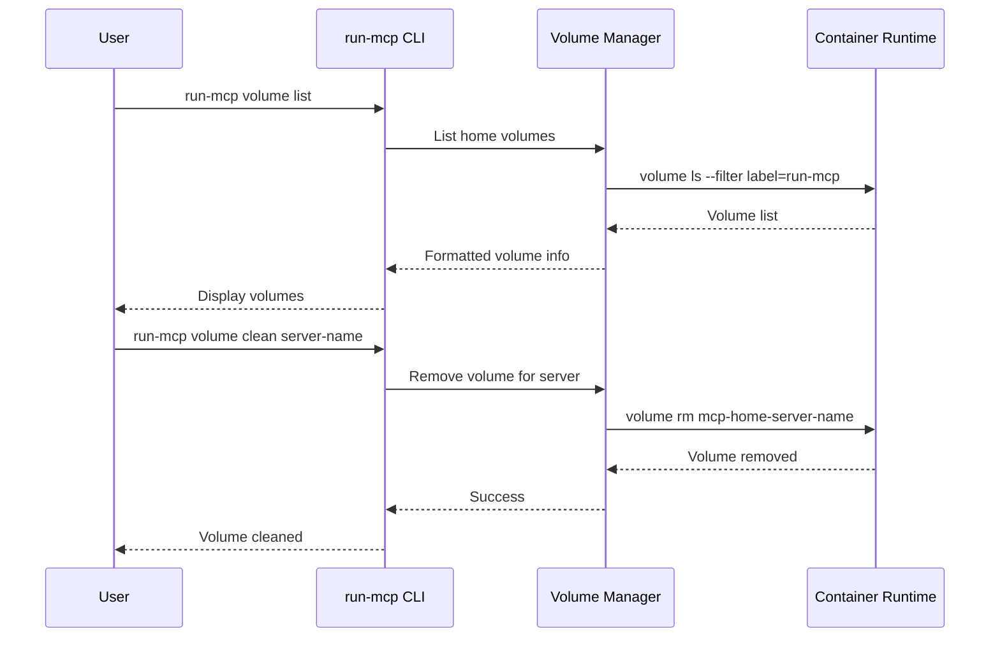

# Design Document: Container Home Isolation

## Overview

The container home isolation feature extends the existing `run-mcp` binary to provide persistent, isolated home directories for MCP servers using container volumes. This design builds upon the current volume management system while adding dedicated home directory isolation that works across all supported container runtimes (Docker, Podman, Nerdctl, Finch, Lima).

The solution addresses the core problem where MCP servers fail when trying to write to read-only container filesystems by providing writable, persistent storage mounted at `/home/mcp` for all container types.

## Architecture

### High-Level Architecture

```mermaid
graph TB
    User[User Command] --> CLI[run-mcp CLI]
    CLI --> RT[Runtime Detector]
    CLI --> VM[Volume Manager]
    CLI --> LM[Language Manager]
    
    RT --> Docker[Docker]
    RT --> Podman[Podman] 
    RT --> Nerdctl[Nerdctl]
    RT --> Finch[Finch]
    RT --> Lima[Lima]
    
    VM --> VC[Volume Commands]
    VM --> VN[Volume Naming]
    VM --> VL[Volume Lifecycle]
    
    VC --> CVol[Container Volumes]
    CVol --> Home[/home/mcp Mount]
    
    LM --> Python[Python Container]
    LM --> NodeJS[Node.js Container]
    
    Python --> Home
    NodeJS --> Home
```

### Component Integration

The design integrates with existing `run-mcp` components:

1. **Runtime Detector**: Already detects available container runtimes
2. **Volume Manager**: Extended to handle home directory volumes
3. **Language Manager**: Updated to ensure consistent `/home/mcp` usage
4. **Configuration**: Extended with volume-related settings

## Components and Interfaces

### Enhanced Volume Manager

The existing `VolumeManager` will be extended with home directory isolation and user mount capabilities:

```go
type VolumeManager struct {
    config          *Config
    runtimeDetector *RuntimeDetector
    homeVolumes     map[string]string // server-name -> volume-name mapping
}

// Home directory volume management
func (vm *VolumeManager) CreateHomeVolume(serverName, runtime string) (string, error) {
    volumeName := sanitizeVolumeName(serverName)
    
    cmd := exec.Command(runtime, "volume", "create",
        "--label", "run-mcp=true",
        "--label", fmt.Sprintf("run-mcp.runtime=%s", runtime),
        "--label", fmt.Sprintf("run-mcp.server=%s", serverName),
        volumeName)
    
    return volumeName, cmd.Run()
}

func (vm *VolumeManager) CreateEphemeralVolume(serverName, runtime string) (string, error) {
    volumeName := vm.CreateEphemeralVolumeName(serverName)
    
    cmd := exec.Command(runtime, "volume", "create",
        "--label", "run-mcp=true",
        "--label", "run-mcp.ephemeral=true",
        "--label", fmt.Sprintf("run-mcp.runtime=%s", runtime),
        "--label", fmt.Sprintf("run-mcp.server=%s", serverName),
        volumeName)
    
    return volumeName, cmd.Run()
}

func (vm *VolumeManager) GetHomeVolumeMount(args []string) (string, error)
func (vm *VolumeManager) ListHomeVolumes() ([]VolumeInfo, error)
func (vm *VolumeManager) RemoveHomeVolume(serverName string) error
func (vm *VolumeManager) PruneHomeVolumes() error
func (vm *VolumeManager) InspectHomeVolume(serverName string) (*VolumeDetails, error)

// User mount configuration
func (vm *VolumeManager) ParseUserMounts() ([]string, error)
func (vm *VolumeManager) GetVolumeMounts(args []string) []string
func (vm *VolumeManager) ExpandPath(path string) string
func (vm *VolumeManager) ToContainerPath(hostPath string) string
```

### User Mount Parser

A new component handles `MCP_MOUNT` parsing and path expansion:

```go
type UserMountParser struct{}

func (ump *UserMountParser) ParseMountString(mountStr string) ([]Mount, error) {
    // ... parsing logic ...
    if err != nil {
        return nil, fmt.Errorf("invalid MCP_MOUNT syntax: %s\n\nExpected format: <src>:<dest>[:<opts>],<src>:<dest>[:<opts>],...\nExample: MCP_MOUNT=~/.aws:/home/mcp/.aws:ro,~/data:/data", mountStr)
    }
    // ...
}

func (ump *UserMountParser) ExpandTildePath(path string) string
func (ump *UserMountParser) ConvertWindowsPath(path string) string

func (ump *UserMountParser) ValidateMount(mount Mount) error {
    expandedSource := ump.ExpandTildePath(mount.Source)
    if _, err := os.Stat(expandedSource); os.IsNotExist(err) {
        return fmt.Errorf("mount source path does not exist: %s", mount.Source)
    }
    return nil
}

type Mount struct {
    Source      string
    Destination string
    Options     string
}
```

### Home Directory Override Handler

Manages `MCP_BIND_HOME` and `MCP_HOME_PATH` overrides:

```go
type HomeOverrideHandler struct{}

func (hoh *HomeOverrideHandler) GetHomeMount(args []string) string
func (hoh *HomeOverrideHandler) CreateBindHomeDir(volumeName string) (string, error)
func (hoh *HomeOverrideHandler) ValidateCustomHomePath(path string) error
```

### Volume Command Interface

A new interface abstracts container runtime volume operations:

```go
type VolumeCommander interface {
    CreateVolume(name string) error
    ListVolumes() ([]VolumeInfo, error)
    RemoveVolume(name string) error
    InspectVolume(name string) (*VolumeDetails, error)
    VolumeExists(name string) (bool, error)
}

// Runtime-specific implementations
type DockerVolumeCommander struct{}
type PodmanVolumeCommander struct{}
type NerdctlVolumeCommander struct{}
// etc.
```

### Server Name Sanitization

A utility component handles server name sanitization for volume naming:

```go
type ServerNameSanitizer struct{}

func (sns *ServerNameSanitizer) SanitizeServerName(args []string) string
func (sns *ServerNameSanitizer) GenerateVolumeName(serverName string) string
func (sns *ServerNameSanitizer) ParseVolumeName(volumeName string) (string, error)
```

### CLI Command Extensions

New CLI commands for volume management:

```go
// New CLI commands
func createVolumeCommand() *cobra.Command
func createVolumeListCommand() *cobra.Command  
func createVolumeCleanCommand() *cobra.Command
func createVolumePruneCommand() *cobra.Command
func createVolumeInspectCommand() *cobra.Command

// Utility functions
func promptConfirmation(message string) bool {
    fmt.Printf("%s [y/N]: ", message)
    var response string
    fmt.Scanln(&response)
    return strings.ToLower(response) == "y"
}
```

## Data Models

### Volume Information

```go
type VolumeInfo struct {
    Name        string    `json:"name"`
    ServerName  string    `json:"server_name"`
    CreatedAt   time.Time `json:"created_at"`
    Size        string    `json:"size,omitempty"`
    Runtime     string    `json:"runtime"`
}

type VolumeDetails struct {
    VolumeInfo
    MountPoint  string            `json:"mount_point"`
    Labels      map[string]string `json:"labels"`
    Options     map[string]string `json:"options"`
    Contents    []FileInfo        `json:"contents,omitempty"`
}

type FileInfo struct {
    Name    string `json:"name"`
    Size    int64  `json:"size"`
    Mode    string `json:"mode"`
    ModTime string `json:"mod_time"`
}
```

### Configuration Extensions

```go
type Config struct {
    // Existing fields...
    NodejsImage      string
    PythonImage      string
    DataDir          string
    ContainerRuntime string
    
    // New volume-related fields
    VolumePrefix     string // Default: "mcp-home"
    EphemeralMode    bool   // Default: false
    MaxVolumeSize    string // Default: "" (unlimited)
    
    // New mount configuration fields
    UserMounts       string // MCP_MOUNT environment variable
    BindHome         bool   // MCP_BIND_HOME flag
    CustomHomePath   string // MCP_HOME_PATH override
}
```

## Volume Naming Strategy

### Updated Naming Convention

Volume names follow the pattern: `mcp-home-{sanitized-command}-{sanitized-first-arg}`

### Server Name Sanitization Algorithm

1. **Extract command components**: Use command + first non-flag argument (max 2 parts)
2. **Sanitize characters**: Convert to lowercase, replace non-alphanumeric with dashes
3. **Normalize format**: Trim leading/trailing dashes
4. **Apply prefix**: Add `mcp-home-` prefix

Examples:
- `uvx awslabs.aws-api-mcp-server@latest` → `mcp-home-uvx-awslabs-aws-api-mcp-server-latest`
- `npx @modelcontextprotocol/server-filesystem /data` → `mcp-home-npx-modelcontextprotocol-server-filesystem`
- `uvx mcp-server-sqlite --db-path /data/db.sqlite` → `mcp-home-uvx-mcp-server-sqlite`

### Implementation

```go
func sanitizeVolumeName(args []string) string {
    var parts []string
    
    for i, arg := range args {
        // Only use first two args (command + server identifier)
        if i >= 2 {
            break
        }
        // Stop at flags
        if strings.HasPrefix(arg, "-") {
            break
        }
        
        // Sanitize: lowercase, replace non-alphanumeric with dash
        sanitized := strings.ToLower(arg)
        sanitized = regexp.MustCompile(`[^a-z0-9]+`).ReplaceAllString(sanitized, "-")
        sanitized = strings.Trim(sanitized, "-")
        
        if sanitized != "" {
            parts = append(parts, sanitized)
        }
    }
    
    if len(parts) == 0 {
        return "mcp-home-default"
    }
    
    name := "mcp-home-" + strings.Join(parts, "-")
    
    // Truncate if exceeds 64 characters
    if len(name) > 64 {
        hash := fmt.Sprintf("%08x", crc32.ChecksumIEEE([]byte(name)))
        name = name[:56] + "-" + hash
    }
    
    return name
}

func (vm *VolumeManager) CreateEphemeralVolumeName(serverName string) string {
    timestamp := time.Now().Unix()
    name := fmt.Sprintf("mcp-ephemeral-%s-%d", serverName, timestamp)
    
    // Apply same truncation logic for consistency
    if len(name) > 64 {
        hash := fmt.Sprintf("%08x", crc32.ChecksumIEEE([]byte(name)))
        name = name[:56] + "-" + hash
    }
    
    return name
}
```

### Volume Lifecycle



## Container Integration

### Home Directory Standardization

Both container types will use `/home/mcp` as the home directory:

**Python Container** (already compliant):
- User: `mcp` (UID 1000)
- Home: `/home/mcp`
- ENV: `HOME=/home/mcp`

**Node.js Container** (requires update):
- User: `node` (UID 1000) 
- Home: `/home/mcp` (changed from `/home/node`)
- ENV: `HOME=/home/mcp`

### Volume Mount Integration

The volume mount will be added to existing container arguments with user-specified mounts:

```bash
# Minimal (no host access)
docker run -i --rm \
  -v mcp-home-npx-modelcontextprotocol-server-memory:/home/mcp \
  ghcr.io/serverless-dna/run-mcp-nodejs:latest \
  npx @modelcontextprotocol/server-memory

# With user mounts (credentials + data)
docker run -i --rm \
  -v mcp-home-uvx-awslabs-aws-api-mcp-server:/home/mcp \
  -v /home/user/.aws:/home/mcp/.aws:ro \
  -v /home/user/data:/data \
  ghcr.io/serverless-dna/run-mcp-python:latest \
  uvx awslabs.aws-api-mcp-server@latest

# With bind home override
docker run -i --rm \
  -v /home/user/.run-mcp/mcp-home-uvx-mcp-server-sqlite:/home/mcp \
  -v /home/user/databases:/data \
  ghcr.io/serverless-dna/run-mcp-python:latest \
  uvx mcp-server-sqlite --db-path /data/mydb.sqlite
```

## Implementation Flow

### Container Startup Flow



### Volume Management Flow



## Error Handling

### Volume Creation Failures

1. **Runtime unavailable**: Clear error message with installation instructions
2. **Permission denied**: Suggest running with appropriate permissions
3. **Disk space**: Warning about insufficient space
4. **Volume conflicts**: Automatic resolution or user guidance

### Container Mount Failures

1. **Volume not found**: Automatic recreation attempt
2. **Mount permission issues**: Clear diagnostic information
3. **Path conflicts**: Fallback strategies

### Recovery Strategies

1. **Graceful degradation**: Fall back to existing behavior if volume creation fails
2. **Automatic retry**: Retry volume operations with exponential backoff
3. **User guidance**: Provide actionable error messages and suggestions

## Testing Strategy

*A property is a characteristic or behavior that should hold true across all valid executions of a system—essentially, a formal statement about what the system should do. Properties serve as the bridge between human-readable specifications and machine-verifiable correctness guarantees.*

### Property-Based Testing

Property-based tests will validate universal correctness properties using a Go property testing library (such as `gopter` or `rapid`). Each test will run a minimum of 100 iterations to ensure comprehensive coverage.

## Correctness Properties

Based on the requirements analysis, the following correctness properties must hold for all valid system executions:

### Property 1: Volume Creation Consistency
*For any* MCP server command and supported container runtime, when run-mcp starts a container, a named container volume should be created following the deterministic naming pattern `mcp-home-{sanitized-command}-{sanitized-first-arg}`.
**Validates: Requirements 1.1, 2.1, 2.2, 2.3**

### Property 2: Volume Reuse Idempotency  
*For any* MCP server command, running the same command multiple times should always reuse the same volume, ensuring data persistence and consistency across executions.
**Validates: Requirements 1.2, 2.4, 4.2**

### Property 3: Home Directory Write Access
*For any* file or directory operation within `/home/mcp`, the container should have full read/write permissions, enabling MCP servers to create configuration files, logs, and cache data.
**Validates: Requirements 1.3, 3.2**

### Property 4: Host Filesystem Isolation
*For any* container operation, the Container_Home volume should be completely isolated from the Host_Filesystem, preventing access to or modification of host directories unless explicitly configured via `MCP_MOUNT`.
**Validates: Requirements 1.4, 7.5, 8.1, 8.2, 8.3**

### Property 5: Consistent Mount Point
*For any* container type (Python or Node.js) and MCP server command, the Container_Home volume should always be mounted at `/home/mcp` with read/write permissions.
**Validates: Requirements 1.5**

### Property 6: Volume Management Commands
*For any* set of managed volumes, the volume list, clean, and inspect commands should correctly display, remove, and show details for volumes matching the `mcp-home-*` pattern.
**Validates: Requirements 2.5, 4.4, 4.5, 4.8, 4.10**

### Property 7: Environment Variable Passthrough
*For any* user-provided environment variables, run-mcp should pass them through to the container without modification, preserving both names and values.
**Validates: Requirements 3.1, 3.3**

### Property 8: User Mount Configuration
*For any* valid `MCP_MOUNT` specification, run-mcp should correctly parse, expand paths (including tilde expansion), and mount the specified host directories to container destinations with appropriate options.
**Validates: Requirements 7.1, 7.2, 7.3, 7.4, 7.8**

### Property 9: Home Directory Override Behavior
*For any* home directory override (`MCP_BIND_HOME` or `MCP_HOME_PATH`), run-mcp should mount the specified host path to `/home/mcp` instead of using a container volume.
**Validates: Requirements 7.6, 7.7**

### Property 10: Volume Persistence
*For any* created volume, the data should persist indefinitely across container stops, crashes, and restarts until explicitly removed by user commands.
**Validates: Requirements 4.3, 6.1, 6.2, 6.3**

### Property 11: Volume Prune Operation
*For any* set of managed volumes, the prune command should remove all volumes with the `mcp-home-*` pattern, leaving no managed volumes remaining.
**Validates: Requirements 4.6, 4.7**

### Property 12: Backward Compatibility
*For any* existing MCP server command that worked before volume isolation, the command should continue to work transparently with automatic volume creation.
**Validates: Requirements 5.1, 5.4**

### Property 13: Ephemeral Volume Cleanup
*For any* container run with the `--ephemeral` flag, the associated volume should be automatically removed when the container stops.
**Validates: Requirements 6.3, 6.4, 6.5**

### Property 14: Container Permission Boundaries
*For any* container user operations, the user should have appropriate permissions within the Container_Home but no access to host filesystem resources unless explicitly mounted via `MCP_MOUNT`.
**Validates: Requirements 8.5**

### Unit Testing Focus Areas

Unit tests will complement property tests by focusing on:

- **Server name sanitization edge cases**: Empty commands, special characters, very long names
- **Error handling scenarios**: Runtime unavailable, permission denied, disk space issues
- **CLI command parsing**: Argument validation, help text, error messages
- **Configuration validation**: Invalid images, missing directories, malformed settings
- **Volume command integration**: Runtime-specific command generation and execution

### Testing Implementation

Property-based tests will be implemented using Go's `testing/quick` package or a dedicated library like `gopter`. Each property test will:

- Run a minimum of 100 iterations with randomized inputs
- Generate valid MCP server commands, container runtimes, and system states
- Verify the specified property holds across all generated test cases
- Include appropriate shrinking to find minimal failing examples
- Be tagged with comments referencing the design document property

Example test structure:
```go
// Feature: container-home-isolation, Property 1: Volume Creation Consistency
func TestVolumeCreationConsistency(t *testing.T) {
    property := func(serverCmd []string, runtime string) bool {
        // Generate volume name from server command
        // Verify it follows run-mcp-{sanitized-name} pattern
        // Return true if property holds
    }
    
    if err := quick.Check(property, &quick.Config{MaxCount: 100}); err != nil {
        t.Error(err)
    }
}
```

## Security Considerations

### Volume Isolation
- Container volumes provide filesystem-level isolation from host
- No bind mounts to sensitive host directories
- Container user (UID 1000) has no host privileges

### Runtime Security
- Leverages container runtime's built-in security mechanisms
- No privileged container execution required
- Standard container security policies apply

### Data Protection
- Volume data persists independently of container lifecycle
- No automatic data exposure to host filesystem
- User-controlled cleanup prevents data leakage

## Performance Considerations

### Volume Operations
- Volume creation is one-time cost per unique server command
- Volume reuse eliminates repeated creation overhead
- Container startup time includes volume mount overhead (~10-50ms)

### Storage Management
- Volumes consume disk space until explicitly cleaned
- No automatic size limits by default (configurable)
- Volume metadata operations are lightweight

### Scalability
- Linear scaling with number of unique MCP server commands
- Volume management commands scale with total volume count
- No cross-volume dependencies or locking

## Migration and Compatibility

### Existing Users
- Transparent migration: existing commands work without changes
- Automatic volume creation on first run
- No breaking changes to CLI interface

### Container Updates
- Node.js container requires update to use `/home/mcp` instead of `/home/node`
- Python container already compliant
- Both containers maintain UID 1000 for consistency

### Runtime Support
- All supported runtimes (Docker, Podman, Nerdctl, Finch, Lima) provide volume functionality
- Consistent volume command interface across runtimes
- Runtime detection handles differences transparently