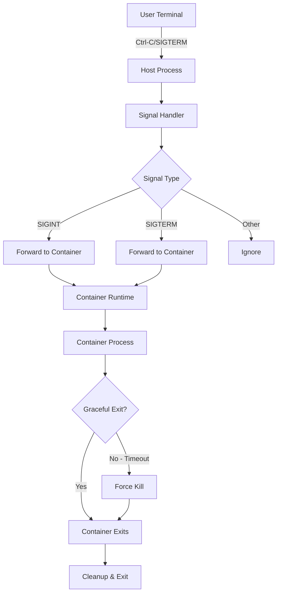
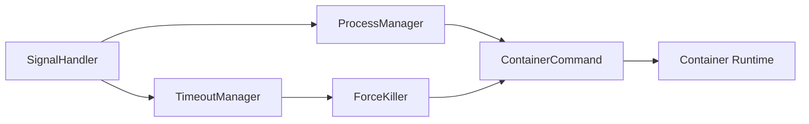

# Design Document: Container Signal Handling

## Overview

This design implements proper signal handling for the run-mcp tool to ensure that terminal signals (Ctrl-C, SIGTERM, etc.) are correctly forwarded to containerized MCP server processes. The current implementation uses `exec.Cmd.Run()` which blocks until completion but doesn't handle signals, leaving containers running when users attempt to interrupt the process.

The solution replaces the blocking `Run()` call with `Start()` followed by signal handling and `Wait()`, allowing the host process to capture signals and forward them to the container using the container runtime's signal forwarding capabilities.

## Architecture

### Signal Flow Architecture



### Component Architecture



## Components and Interfaces

### SignalHandler Interface

The `SignalHandler` manages signal capture and forwarding:

```go
type SignalHandler interface {
    // Start begins signal monitoring for the given process
    Start(cmd *exec.Cmd) error
    
    // Stop stops signal monitoring and cleanup
    Stop() error
    
    // SetTimeout configures signal timeout values
    SetTimeout(sigint, sigterm time.Duration)
}

type DefaultSignalHandler struct {
    cmd           *exec.Cmd
    signalChan    chan os.Signal
    done          chan bool
    sigintTimeout time.Duration
    sigtermTimeout time.Duration
    logger        Logger
}
```

### ProcessManager Interface

The `ProcessManager` handles container process lifecycle:

```go
type ProcessManager interface {
    // StartContainer starts the container and returns immediately
    StartContainer(cmd *exec.Cmd) error
    
    // WaitForExit waits for container to exit and returns exit code
    WaitForExit() (int, error)
    
    // ForwardSignal sends a signal to the container
    ForwardSignal(signal os.Signal) error
    
    // ForceKill forcefully terminates the container
    ForceKill() error
}
```

### TimeoutManager Interface

The `TimeoutManager` handles graceful shutdown timeouts:

```go
type TimeoutManager interface {
    // StartTimeout begins timeout monitoring for a signal
    StartTimeout(signal os.Signal, duration time.Duration, callback func()) *time.Timer
    
    // CancelTimeout cancels an active timeout
    CancelTimeout(timer *time.Timer)
}
```

## Data Models

### Signal Configuration

```go
type SignalConfig struct {
    SigintTimeout  time.Duration `default:"5s"`
    SigtermTimeout time.Duration `default:"10s"`
    EnableLogging  bool          `default:"false"`
}

func LoadSignalConfig() *SignalConfig {
    config := &SignalConfig{
        SigintTimeout:  5 * time.Second,
        SigtermTimeout: 10 * time.Second,
        EnableLogging:  false,
    }
    
    if timeout := os.Getenv("MCP_SIGNAL_TIMEOUT"); timeout != "" {
        if duration, err := time.ParseDuration(timeout); err == nil {
            config.SigtermTimeout = duration
            config.SigintTimeout = duration / 2 // SIGINT is faster
        }
    }
    
    return config
}
```

### Container Process State

```go
type ProcessState struct {
    PID           int
    ContainerName string
    Runtime       string
    StartTime     time.Time
    Status        ProcessStatus
}

type ProcessStatus int

const (
    StatusStarting ProcessStatus = iota
    StatusRunning
    StatusStopping
    StatusStopped
    StatusKilled
)
```

## Implementation Strategy

### Signal Handling Implementation

Replace the current blocking execution pattern:

```go
// Current implementation (blocking)
containerCmd.Stdin = os.Stdin
containerCmd.Stdout = os.Stdout
containerCmd.Stderr = os.Stderr
if err := containerCmd.Run(); err != nil {
    return err
}
```

With signal-aware execution:

```go
// New implementation (signal-aware)
signalHandler := NewSignalHandler()
processManager := NewProcessManager(containerRuntime)

// Configure stdio
containerCmd.Stdin = os.Stdin
containerCmd.Stdout = os.Stdout
containerCmd.Stderr = os.Stderr

// Start container
if err := processManager.StartContainer(containerCmd); err != nil {
    return err
}

// Start signal handling
if err := signalHandler.Start(containerCmd); err != nil {
    return err
}

// Wait for completion
exitCode, err := processManager.WaitForExit()
signalHandler.Stop()

return handleExit(exitCode, err)
```

### Cross-Platform Signal Handling

```go
func (sh *DefaultSignalHandler) setupSignalCapture() {
    sh.signalChan = make(chan os.Signal, 1)
    
    // Platform-specific signal registration
    switch runtime.GOOS {
    case "windows":
        signal.Notify(sh.signalChan, os.Interrupt)
    case "linux", "darwin":
        signal.Notify(sh.signalChan, syscall.SIGINT, syscall.SIGTERM, syscall.SIGQUIT)
    default:
        signal.Notify(sh.signalChan, os.Interrupt)
    }
}
```

### Container Signal Forwarding

**Container Naming Strategy:**

To enable signal forwarding, we generate a unique container name and use the `--name` flag:

```go
type ContainerProcessManager struct {
    cmd           *exec.Cmd
    containerName string  // Generated unique name for signal forwarding
    runtime       string
    logger        Logger
}

func NewContainerProcessManager(runtime string, args []string) *ContainerProcessManager {
    // Generate unique name from server args + timestamp
    baseName := sanitizeVolumeName(args)  // e.g., "mcp-uvx-mcp-server-sqlite"
    containerName := fmt.Sprintf("%s-%d", baseName, time.Now().UnixNano())
    
    return &ContainerProcessManager{
        containerName: containerName,
        runtime:       runtime,
    }
}

func (pm *ContainerProcessManager) BuildCommand(image string, args []string) *exec.Cmd {
    cmdArgs := []string{
        "run",
        "-i",
        "--rm",
        "--name", pm.containerName,  // Key addition for signal forwarding
        image,
    }
    cmdArgs = append(cmdArgs, args...)
    
    return exec.Command(pm.runtime, cmdArgs...)
}
```

**Signal Forwarding Implementation:**

```go
func (pm *ContainerProcessManager) ForwardSignal(sig os.Signal) error {
    // All runtimes use the same pattern: <runtime> kill --signal <signal> <container>
    signalName := getSignalName(sig)
    
    // Build command - works for all runtimes including "lima nerdctl"
    parts := strings.Fields(pm.runtime) // Handles both "docker" and "lima nerdctl"
    args := append(parts[1:], "kill", "--signal", signalName, pm.containerName)
    cmd := exec.Command(parts[0], args...)
    
    return cmd.Run()
}

func (pm *ContainerProcessManager) ForceKill() error {
    parts := strings.Fields(pm.runtime)
    args := append(parts[1:], "kill", "--signal", "SIGKILL", pm.containerName)
    cmd := exec.Command(parts[0], args...)
    return cmd.Run()
}

// Signal name conversion (cross-platform)
func getSignalName(sig os.Signal) string {
    switch sig {
    case syscall.SIGINT:
        return "SIGINT"
    case syscall.SIGTERM:
        return "SIGTERM"
    case syscall.SIGKILL:
        return "SIGKILL"
    case syscall.SIGQUIT:
        return "SIGQUIT"
    default:
        return sig.String()
    }
}
```

**Why This Works:**
- Docker: `docker kill --signal SIGTERM <container>` → parts=["docker"], args=["kill", "--signal", "SIGTERM", "<container>"]
- Podman: `podman kill --signal SIGTERM <container>` → parts=["podman"], args=["kill", "--signal", "SIGTERM", "<container>"]  
- Nerdctl: `nerdctl kill --signal SIGTERM <container>` → parts=["nerdctl"], args=["kill", "--signal", "SIGTERM", "<container>"]
- Lima: `lima nerdctl kill --signal SIGTERM <container>` → parts=["lima", "nerdctl"], args=["nerdctl", "kill", "--signal", "SIGTERM", "<container>"]

The `strings.Fields()` approach handles both single-word runtimes ("docker") and multi-word runtimes ("lima nerdctl") uniformly.

**Note on stdin EOF Handling:**
stdin EOF is handled by the container runtime. When the parent process closes stdin, Docker/Podman propagates this to the container. The signal handler monitors for container exit rather than explicitly watching stdin.

### Timeout and Force Termination

```go
func (sh *DefaultSignalHandler) handleSignal(sig os.Signal) {
    sh.logger.Debug("Received signal: %v", sig)
    
    // Forward signal to container
    if err := sh.processManager.ForwardSignal(sig); err != nil {
        sh.logger.Error("Failed to forward signal: %v", err)
        return
    }
    
    // Start timeout for graceful shutdown
    timeout := sh.getTimeoutForSignal(sig)
    timer := time.AfterFunc(timeout, func() {
        sh.logger.Warn("Signal timeout exceeded, forcing termination")
        if err := sh.processManager.ForceKill(); err != nil {
            sh.logger.Error("Force kill failed: %v", err)
        }
    })
    
    // Cancel timeout if process exits gracefully
    go func() {
        <-sh.done
        timer.Stop()
    }()
}
```

## Integration with Existing Code

### Modification Points

1. **main.go**: Replace `containerCmd.Run()` with signal-aware execution
2. **New file: signal.go**: Implement signal handling components
3. **New file: process.go**: Implement process management components
4. **config.go**: Add signal configuration loading
5. **errors.go**: Add signal-related error handling

### Backward Compatibility

The changes maintain full backward compatibility:
- All existing command-line flags and environment variables work unchanged
- Exit codes remain the same for normal operation
- Only signal handling behavior changes (improvement)
- No breaking changes to the public API

### Container Runtime Integration

The signal forwarding integrates with existing runtime detection:

```go
func buildContainerCommandWithSignals(config *Config, containerRuntime, language string, args []string) (*exec.Cmd, string, *SignalHandler, error) {
    // Get the appropriate image for the language
    image, err := config.GetImageForLanguage(language)
    if err != nil {
        return nil, "", nil, err
    }

    // Create process manager with container naming
    processManager := NewContainerProcessManager(containerRuntime, args)
    
    // Build container command with --name flag
    containerCmd := processManager.BuildCommand(image, args)
    
    // Add existing volume and environment setup...
    // (existing volume mounting and env var logic remains the same)
    
    // Create signal handler
    signalHandler := NewSignalHandler(processManager)
    
    return containerCmd, volumeName, signalHandler, nil
}
```

### Updated Main Execution Flow

```go
func executeWithSignalHandling(config *Config, containerRuntime string, args []string) error {
    // Build container command with signal handling
    containerCmd, volumeName, signalHandler, err := buildContainerCommandWithSignals(config, containerRuntime, language, args)
    if err != nil {
        return err
    }
    
    // Configure stdio
    containerCmd.Stdin = os.Stdin
    containerCmd.Stdout = os.Stdout
    containerCmd.Stderr = os.Stderr
    
    // Start container
    processManager := signalHandler.GetProcessManager()
    if err := processManager.StartContainer(containerCmd); err != nil {
        return err
    }
    
    // Start signal handling
    if err := signalHandler.Start(containerCmd); err != nil {
        return err
    }
    
    // Wait for completion
    exitCode, err := processManager.WaitForExit()
    signalHandler.Stop()
    
    // Cleanup ephemeral volume if needed (AFTER container exits)
    if config.EphemeralMode && volumeName != "" {
        volumeManager := NewVolumeManagerWithRuntime(config, containerRuntime)
        if cleanupErr := volumeManager.CleanupEphemeralVolume(volumeName); cleanupErr != nil {
            fmt.Fprintf(os.Stderr, "Warning: Failed to cleanup ephemeral volume %s: %v\n", volumeName, cleanupErr)
        }
    }
    
    return handleExit(exitCode, err)
}
```

## Correctness Properties

*A property is a characteristic or behavior that should hold true across all valid executions of a system-essentially, a formal statement about what the system should do. Properties serve as the bridge between human-readable specifications and machine-verifiable correctness guarantees.*

### Property 1: Signal Forwarding Consistency
*For any* supported container runtime and any supported signal, when the signal is sent to the host process, the signal should be successfully forwarded to the container process using the appropriate runtime-specific mechanism.
**Validates: Requirements 1.1, 1.2, 4.1, 4.2, 4.3, 4.4**

### Property 2: Exit Code Propagation
*For any* container exit code, when the container process exits after receiving a signal, the host process should exit with the same exit code.
**Validates: Requirements 1.4**

### Property 3: Graceful Shutdown Wait
*For any* signal forwarded to a container process, the host process should wait for the container to exit gracefully before terminating itself.
**Validates: Requirements 1.3**

### Property 4: Timeout-Based Force Termination
*For any* container process that doesn't respond to signals within the configured timeout, the signal handler should send SIGKILL to force termination.
**Validates: Requirements 2.1, 2.2**

### Property 5: Configuration Loading
*For any* valid MCP_SIGNAL_TIMEOUT environment variable value, the timeout configuration should be loaded correctly with appropriate defaults when the variable is not set.
**Validates: Requirements 2.3**

### Property 6: Platform Signal Support
*For any* supported platform (Linux, macOS, Windows), the signal handler should correctly handle the platform-appropriate signals (SIGINT/SIGTERM/SIGQUIT on Unix, os.Interrupt on Windows).
**Validates: Requirements 3.1, 3.2, 3.3**

### Property 7: Unsupported Signal Resilience
*For any* unsupported signal sent to the host process, the signal handler should ignore it and continue normal operation without disruption.
**Validates: Requirements 3.5**

### Property 8: Process Group Independence
*For any* process group configuration, the signal handler should handle signals independently of the process group, ensuring proper signal forwarding regardless of group membership.
**Validates: Requirements 5.1**

### Property 9: Child Process Signal Propagation
*For any* container process that spawns child processes, when a signal is forwarded to the container, all child processes should also receive the signal.
**Validates: Requirements 5.2**

### Property 10: Host Termination Cleanup
*For any* scenario where the host process is terminated by its parent, the container process should also be terminated to prevent orphaned containers.
**Validates: Requirements 5.4**

### Property 11: Ephemeral Volume Cleanup
*For any* execution using the --ephemeral flag, when signal handling triggers container termination, volume cleanup should complete before the host process exits.
**Validates: Requirements 5.5**

### Property 12: Error Handling Resilience
*For any* container runtime error during signal forwarding, the signal handler should log descriptive error messages and handle the failure gracefully.
**Validates: Requirements 6.1, 6.3**

### Property 13: Duplicate Signal Handling
*For any* container process that has already terminated, sending additional signals should be handled gracefully without errors or crashes.
**Validates: Requirements 6.2**

### Property 14: Force Termination Error Handling
*For any* scenario where force termination fails, the signal handler should report the failure and exit with an appropriate error code.
**Validates: Requirements 6.4**

### Property 15: Comprehensive Logging
*For any* signal handling operation (signal receipt, forwarding, timeout, force termination), appropriate log messages should be generated at the correct log levels with relevant details.
**Validates: Requirements 2.4, 7.1, 7.2, 7.3, 7.4**

### Property 16: Stream Draining
*For any* signal received while stdout/stderr streams have pending data, the host process should allow streams to drain before proceeding with termination.
**Validates: Requirements 8.1**

### Property 17: EOF Detection and Shutdown
*For any* container process that closes its streams, the host process should detect EOF and initiate the appropriate shutdown sequence.
**Validates: Requirements 8.2**

### Property 18: Stream Timeout Override
*For any* stream draining operation that exceeds the signal timeout, the host process should proceed with force termination rather than waiting indefinitely.
**Validates: Requirements 8.3**

### Property 19: Stdin EOF Handling
*For any* scenario where stdin is closed by the parent process, the signal handler should initiate graceful shutdown of the container process.
**Validates: Requirements 8.4**

## Error Handling

### Signal Forwarding Failures

When signal forwarding fails, the system provides detailed error messages and recovery options:

```go
type SignalError struct {
    Signal    os.Signal
    Runtime   string
    Container string
    Cause     error
}

func (e *SignalError) Error() string {
    return fmt.Sprintf("failed to forward %v to container %s using %s: %v", 
        e.Signal, e.Container, e.Runtime, e.Cause)
}
```

### Timeout Handling

The system implements progressive timeout handling:
1. **Graceful timeout**: Wait for normal signal response
2. **Force timeout**: Send SIGKILL if graceful fails
3. **Absolute timeout**: Exit with error if force fails

### Platform-Specific Error Handling

Different platforms have different signal limitations:
- **Unix systems**: Full signal support with detailed error reporting
- **Windows**: Limited signal support with equivalent behavior mapping
- **Unsupported platforms**: Graceful degradation with warnings

## Testing Strategy

### Dual Testing Approach

The implementation uses both unit tests and property-based tests for comprehensive coverage:

**Unit Tests:**
- Test specific signal scenarios (SIGINT, SIGTERM, SIGKILL)
- Test platform-specific behavior
- Test error conditions and edge cases
- Test integration with existing container runtime detection

**Property-Based Tests:**
- Test signal forwarding across all supported runtimes and signals
- Test timeout behavior with various delay scenarios
- Test configuration loading with different environment variable values
- Test error handling with simulated runtime failures

### Property-Based Testing Configuration

Each property test runs a minimum of 100 iterations to ensure comprehensive coverage. Tests are tagged with references to their corresponding design properties:

- **Feature: container-signal-handling, Property 1**: Signal forwarding consistency
- **Feature: container-signal-handling, Property 4**: Timeout-based force termination
- **Feature: container-signal-handling, Property 15**: Comprehensive logging

### Testing Framework

The implementation uses Go's standard testing framework with the following property-based testing library:
- **gopter**: For property-based test generation and execution
- **testify**: For assertions and test utilities
- **logrus/test**: For log output verification

### Test Categories

1. **Signal Handling Tests**: Verify signal capture, forwarding, and timeout behavior
2. **Platform Compatibility Tests**: Ensure consistent behavior across operating systems
3. **Runtime Integration Tests**: Test with Docker, Podman, Nerdctl, and other runtimes
4. **Error Scenario Tests**: Test failure modes and recovery behavior
5. **Performance Tests**: Verify signal handling doesn't introduce significant latency