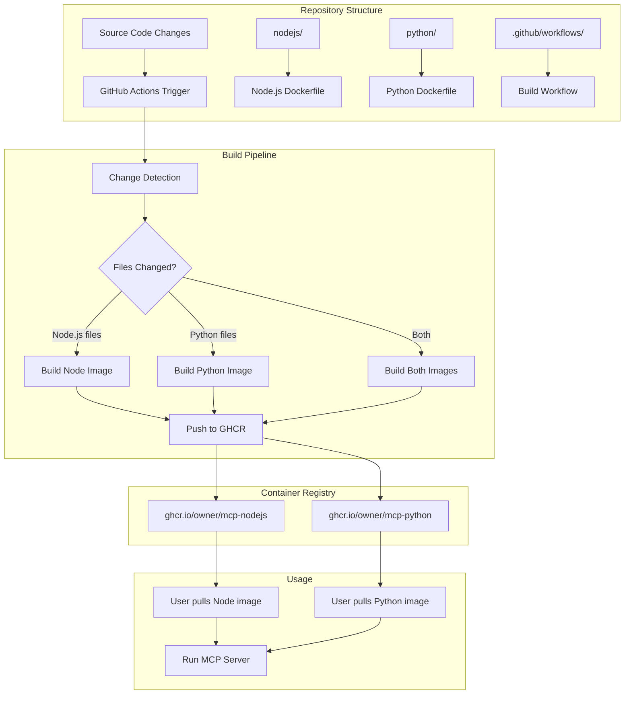

# Design Document: MCP Container Images

## Overview

This system provides automated building and distribution of language-specific container images optimized for running MCP (Model Context Protocol) servers. The solution uses GitHub Actions to build Docker images for Node.js and Python (uv) environments, automatically triggered by file changes and published to GitHub Container Registry.

The design emphasizes efficiency through selective building (only rebuilding changed images), multi-stage Docker builds for optimal image size, and standardized interfaces across language runtimes.

## Architecture



## Components and Interfaces

### 1. Repository Structure

```
├── nodejs/              # Node.js container source files
├── python/              # Python container source files  
├── cmd/
│   └── run-mcp/         # Go binary source code
│       ├── main.go
│       ├── config.go
│       ├── runtime.go
│       └── env.go
├── scripts/             # Build and utility scripts
│   ├── detect-changes.sh    # Change detection for builds
│   └── check-upstream-versions.sh  # Upstream version checking
├── .github/workflows/   # GitHub Actions workflows
│   ├── build-containers.yml
│   ├── check-upstream.yml
│   └── build-run-mcp.yml    # Cross-platform binary builds
├── versions.json
├── go.mod               # Go module definition
├── go.sum               # Go module checksums
└── README.md           # This file
```

### 2. GitHub Actions Workflow

**Primary Workflow**: `.github/workflows/build-containers.yml`
- **Trigger**: Push to main branch, pull requests, manual workflow_dispatch
- **Change Detection**: Uses robust git diff with fallback strategies
- **Multi-Architecture**: Builds for AMD64 and ARM64 using buildx
- **Conditional Jobs**: Separate jobs for each container type
- **Authentication**: Uses GITHUB_TOKEN for GHCR access
- **Caching**: Docker layer caching and registry cache for faster builds
- **Quality Gates**: Hadolint linting, vulnerability scanning, size validation

**Manual Trigger Support**:
- `workflow_dispatch` event allows manual rebuilds
- Supports building specific containers or all containers
- Useful for emergency rebuilds or testing

**Cache Invalidation Strategy**:
- **Layer cache**: Invalidated when Dockerfile or base dependencies change
- **Registry cache**: Uses `--cache-from` with previous image versions
- **Dependency cache**: Invalidated when package.json/pyproject.toml change
- **Manual override**: `workflow_dispatch` can force cache bypass

**Build Matrix**:
```yaml
strategy:
  matrix:
    include:
      - container: nodejs
        platform: linux/amd64,linux/arm64
        context: ./nodejs
      - container: python
        platform: linux/amd64,linux/arm64
        context: ./python
```

**Key Features**:
- Path-based filtering using enhanced change detection
- Matrix strategy for parallel multi-arch builds
- Runtime-based tagging (node22, python3.12) with pinned snapshots
- Build failure isolation (one container failure doesn't block others)
- Comprehensive logging and build artifact retention

### 3. Container Images

#### Node.js Container (`mcp-nodejs`)

**Base Image**: `node:lts-alpine` (current LTS)
**Multi-stage Build**:
1. **Build Stage**: Install dependencies, compile TypeScript if needed
2. **Runtime Stage**: Copy only production artifacts, run as non-root user

**Multi-Architecture Support**:
- Built for AMD64 and ARM64 architectures
- Uses Docker buildx for cross-platform builds
- Single manifest supports both architectures

**Features**:
- Pre-installed npm and yarn package managers
- npx available for running published MCP servers
- TypeScript compilation support (for local development)
- Unbuffered stdio for MCP protocol communication
- Optimized layer caching for faster rebuilds
- Signal forwarding for graceful shutdown

**Volume Mount Strategy**:
- User data mounted at `/data` (primary use case)
- Local development code at `/app` with working directory
- Runs as UID 1000 for permission compatibility

**Entrypoint Behavior**:
```bash
#!/bin/sh
# Simple passthrough entrypoint for stdio MCP servers
# Passes all arguments directly to the command
# Ensures unbuffered I/O for stdio transport
# Example usage: docker run -i --rm ghcr.io/owner/mcp-nodejs npx @modelcontextprotocol/server-filesystem /data

exec "$@"
```

**Primary Usage Patterns**:
```bash
# Running published Node.js MCP server from npm
docker run -i --rm -v ~/Documents:/data ghcr.io/owner/mcp-nodejs \
  npx @modelcontextprotocol/server-filesystem /data

# Running local Node.js MCP server
docker run -i --rm -v ~/my-server:/app -w /app ghcr.io/owner/mcp-nodejs \
  node server.js
```

**Claude Desktop Integration**:
```json
{
  "mcpServers": {
    "filesystem": {
      "command": "docker",
      "args": [
        "run", "-i", "--rm", 
        "-v", "/Users/me/Documents:/data",
        "ghcr.io/owner/mcp-nodejs", 
        "npx", "@modelcontextprotocol/server-filesystem", "/data"
      ]
    }
  }
}
```

#### Python Container (`mcp-python`)

**Base Image**: `python:3.12-slim` (current LTS)
**Multi-stage Build**:
1. **Build Stage**: Install uv, compile dependencies
2. **Runtime Stage**: Copy virtual environment, run as non-root user

**Multi-Architecture Support**:
- Built for AMD64 and ARM64 architectures
- Uses Docker buildx for cross-platform builds
- Single manifest supports both architectures

**Features**:
- uv package manager for fast dependency resolution
- uvx available for running published MCP servers
- Virtual environment isolation at `/app/venv`
- Unbuffered stdio for MCP protocol communication
- Optimized for Python MCP servers
- Signal forwarding for graceful shutdown

**Volume Mount Strategy**:
- User data mounted at `/data` (primary use case)
- Local development code at `/app` with working directory
- Virtual environment at `/app/venv`
- Runs as UID 1000 for permission compatibility

**Entrypoint Behavior**:
```bash
#!/bin/sh
# Simple passthrough entrypoint for stdio MCP servers
# Passes all arguments directly to the command
# Ensures unbuffered I/O for stdio transport
# Example usage: docker run -i --rm ghcr.io/owner/mcp-python uvx mcp-server-sqlite --db-path /data/db.sqlite

exec "$@"
```

**Primary Usage Patterns**:
```bash
# Running published Python MCP server from PyPI
docker run -i --rm -v ~/data:/data ghcr.io/owner/mcp-python \
  uvx mcp-server-sqlite --db-path /data/mydb.sqlite

# Running local Python MCP server
docker run -i --rm -v ~/my-server:/app -w /app ghcr.io/owner/mcp-python \
  python server.py
```

**Claude Desktop Integration**:
```json
{
  "mcpServers": {
    "sqlite": {
      "command": "docker",
      "args": [
        "run", "-i", "--rm",
        "-v", "/Users/me/data:/data", 
        "ghcr.io/owner/mcp-python",
        "uvx", "mcp-server-sqlite", "--db-path", "/data/mydb.sqlite"
      ]
    }
  }
}
```

### 4. Change Detection System

**Implementation**: Custom shell script using git diff with robust error handling
**Core Logic**:
```bash
#!/bin/bash
set -euo pipefail

# Handle shallow clones and first commits
if ! git rev-parse HEAD~1 >/dev/null 2>&1; then
    echo "First commit or shallow clone detected, building all containers"
    echo "nodejs-changed=true" >> $GITHUB_OUTPUT
    echo "python-changed=true" >> $GITHUB_OUTPUT
    exit 0
fi

# Detect changes in runtime directories
NODEJS_CHANGED=$(git diff --name-only HEAD~1 HEAD | grep "^nodejs/" || echo "")
PYTHON_CHANGED=$(git diff --name-only HEAD~1 HEAD | grep "^python/" || echo "")

# Handle common files that affect all containers
COMMON_CHANGED=$(git diff --name-only HEAD~1 HEAD | grep -E "^(\.github/workflows/|scripts/|README\.md)" || echo "")

if [[ -n "$COMMON_CHANGED" ]]; then
    echo "Common files changed, building all containers"
    echo "nodejs-changed=true" >> $GITHUB_OUTPUT
    echo "python-changed=true" >> $GITHUB_OUTPUT
else
    echo "nodejs-changed=${NODEJS_CHANGED:+true}" >> $GITHUB_OUTPUT
    echo "python-changed=${PYTHON_CHANGED:+true}" >> $GITHUB_OUTPUT
fi

# Log what triggered builds
echo "Changed files: $(git diff --name-only HEAD~1 HEAD | tr '\n' ' ')"
```

**Error Handling**:
- **Shallow clones**: Fallback to building all containers on first commit
- **Git failures**: Script fails fast with clear error messages
- **Missing directories**: Gracefully handles deleted or moved container directories
- **Merge conflicts**: Git diff handles merge scenarios automatically

**Performance Optimizations**:
- **File filtering**: Only checks relevant paths to minimize git operations
- **Early exit**: Stops processing once common files are detected
- **Caching**: Git operations are cached by GitHub Actions runner

**Integration with GitHub Actions**:
- Sets boolean outputs for conditional job execution
- Provides detailed logging for debugging build decisions
- Supports manual override via workflow_dispatch events

### 5. Upstream Version Detection System

**Scheduled Workflow**: `.github/workflows/check-upstream.yml`
- **Schedule**: Weekly (Sunday 00:00 UTC) via cron
- **Manual trigger**: workflow_dispatch for immediate check

**Detection Logic**:
```bash
#!/bin/bash
# scripts/check-upstream-versions.sh

set -euo pipefail

# Node.js: Check nodejs.org API for specific major version
check_nodejs() {
    local major="$1"      # e.g., "22"
    local current="$2"    # e.g., "22.11.0"
    
    local latest=$(curl -s https://nodejs.org/dist/index.json | \
        jq -r --arg maj "$major" '[.[] | select(.version | startswith("v" + $maj + "."))] | .[0].version' | tr -d 'v')
        
    if [[ "$latest" != "$current" ]]; then
        echo "nodejs-$major=$latest" >> $GITHUB_OUTPUT
        echo "nodejs-$major-update=true" >> $GITHUB_OUTPUT
        echo "New Node.js $major version detected: $current -> $latest"
    else
        echo "nodejs-$major-update=false" >> $GITHUB_OUTPUT
        echo "Node.js $major version $current is current"
    fi
}

# Python: Check endoflife.date API for specific major version
check_python() {
    local major="$1"      # e.g., "3.12"
    local current="$2"    # e.g., "3.12.8"
    
    local latest=$(curl -s https://endoflife.date/api/python.json | \
        jq -r --arg maj "$major" '[.[] | select(.cycle == $maj)] | .[0].latest')
        
    if [[ "$latest" != "$current" ]]; then
        echo "python-$major=$latest" >> $GITHUB_OUTPUT
        echo "python-$major-update=true" >> $GITHUB_OUTPUT
        echo "New Python $major version detected: $current -> $latest"
    else
        echo "python-$major-update=false" >> $GITHUB_OUTPUT
        echo "Python $major version $current is current"
    fi
}

echo "Checking for upstream version updates..."

# Check all tracked Node.js versions
for major in $(jq -r '.nodejs | keys[]' versions.json); do
    current=$(jq -r ".nodejs.\"$major\"" versions.json)
    echo "Current Node.js $major: $current"
    check_nodejs "$major" "$current"
done

# Check all tracked Python versions
for major in $(jq -r '.python | keys[]' versions.json); do
    current=$(jq -r ".python.\"$major\"" versions.json)
    echo "Current Python $major: $current"
    check_python "$major" "$current"
done

echo "Version check completed"
```

**Version Tracking**:
Current built versions stored in `versions.json` at repo root:
```json
{
  "nodejs": {
    "22": "22.11.0",
    "20": "20.18.1"
  },
  "python": {
    "3.12": "3.12.8",
    "3.11": "3.11.11"
  },
  "lastChecked": "2025-01-15T00:00:00Z"
}
```

**Workflow Integration**:
- Scheduled job runs weekly (Sunday 00:00 UTC)
- Compares upstream versions against `versions.json`
- If updates found, triggers `build-containers.yml` with version parameters
- Build workflow updates `versions.json` on successful completion
- Manual trigger available via `workflow_dispatch` for immediate checks

**Error Handling**:
- **API failures**: Graceful handling of upstream API timeouts or errors
- **Version parsing**: Robust parsing of version strings from different sources
- **Network issues**: Retry logic for network-related failures
- **Fallback behavior**: Continue with current versions if upstream check fails

**Security Considerations**:
- API endpoints are well-established and trusted (nodejs.org, endoflife.date)
- Version validation ensures only valid semantic versions are processed
- No sensitive data exposed in version checking process
- Rate limiting respected for upstream APIs

### 6. Container Runner Binary

**Binary**: `run-mcp`
- **Language**: Go (cross-platform compatibility)
- **Purpose**: Simple drop-in replacement for running MCP servers in containers
- **Installation**: Single binary, download from releases or build from source
- **Platforms**: Windows (AMD64), macOS (AMD64, ARM64), Linux (AMD64, ARM64)

**Usage Patterns**:
```bash
# Auto-detect runtime from command
run-mcp uvx mcp-server-sqlite --db-path /data/db.sqlite
run-mcp npx @modelcontextprotocol/server-filesystem /data

# Explicit runtime specification
run-mcp python uvx awslabs.aws-api-mcp-server@latest
run-mcp node npx @modelcontextprotocol/server-memory
```

**MCP Client Configuration**:
```json
{
  "mcpServers": {
    "sqlite": {
      "command": "run-mcp",
      "args": ["uvx", "mcp-server-sqlite", "--db-path", "/data/db.sqlite"],
      "env": {
        "MCP_DATA_DIR": "/Users/me/data"
      }
    }
  }
}
```

**Runtime Detection Order**:
1. `docker`
2. `podman`
3. `nerdctl`
4. `finch` (AWS Finch)
5. `lima nerdctl` (macOS only)

**Language Detection**:
| Command | Detected Runtime |
|---------|------------------|
| `npx`, `node`, `yarn`, `tsx` | Node.js |
| `uvx`, `python`, `python3`, `uv`, `pip` | Python |

**Environment Variable Handling**:
- **Allowlist prefixes**: `AWS_*`, `OPENAI_*`, `ANTHROPIC_*`, `AZURE_*`, `GOOGLE_*`, `MCP_*`, `HF_*`, `REPLICATE_*`, `COHERE_*`
- **Exact matches**: `GITHUB_TOKEN`, `GITLAB_TOKEN`, `DATABASE_URL`, `REDIS_URL`
- **Custom variables**: Use `MCP_PASSTHROUGH_ENV` for additional variables (comma-separated)
- **Security**: Only explicitly allowed variables are passed through (no "pass all" footgun)

**Volume Mounts**:
| Host Path | Container Path | Mode |
|-----------|----------------|------|
| `$MCP_DATA_DIR` (default: `$HOME`) | `/data` | read-write |
| `~/.aws` | `/home/mcp/.aws` | read-only |
| `~/.config` | `/home/mcp/.config` | read-only |

**Configuration via Environment**:
| Variable | Default | Description |
|----------|---------|-------------|
| `MCP_NODEJS_IMAGE` | `ghcr.io/owner/mcp-nodejs:node22` | Node.js container image |
| `MCP_PYTHON_IMAGE` | `ghcr.io/owner/mcp-python:python3.12` | Python container image |
| `MCP_DATA_DIR` | `$HOME` | Host directory mounted as `/data` |
| `MCP_CONTAINER_RUNTIME` | (auto-detect) | Force specific runtime |

**Go Implementation Structure**:
```go
package main

import (
    "fmt"
    "os"
    "os/exec"
    "path/filepath"
    "runtime"
    "strings"
)

// Configuration holds runtime configuration
type Config struct {
    NodejsImage       string
    PythonImage       string
    DataDir           string
    ContainerRuntime  string
}

// RuntimeDetector handles container runtime detection
type RuntimeDetector struct {
    runtimes []string
}

// LanguageDetector handles language detection from commands
type LanguageDetector struct {
    commandMap map[string]string
}

// EnvFilter handles environment variable filtering
type EnvFilter struct {
    allowedPrefixes []string
    allowedExact    map[string]bool
}

func main() {
    config := loadConfig()
    
    // Parse command line arguments
    args := os.Args[1:]
    if len(args) == 0 {
        printUsage()
        os.Exit(1)
    }
    
    // Detect runtime and language
    detector := NewRuntimeDetector()
    runtime, err := detector.Detect()
    if err != nil {
        fmt.Fprintf(os.Stderr, "Error: %v\n", err)
        os.Exit(1)
    }
    
    langDetector := NewLanguageDetector()
    language := langDetector.DetectFromArgs(args)
    
    // Build container command
    cmd := buildContainerCommand(config, runtime, language, args)
    
    // Execute container
    if err := cmd.Run(); err != nil {
        os.Exit(1)
    }
}

// Environment variable filtering with allowlist approach
func getEnvArgs() []string {
    var args []string
    
    // Default allowlist prefixes
    allowedPrefixes := []string{
        "AWS_", "OPENAI_", "ANTHROPIC_", "AZURE_", "GOOGLE_",
        "MCP_", "HF_", "REPLICATE_", "COHERE_",
    }
    
    // Exact matches
    allowedExact := map[string]bool{
        "GITHUB_TOKEN": true,
        "GITLAB_TOKEN": true,
        "DATABASE_URL": true,
        "REDIS_URL":    true,
    }
    
    // User-specified additional vars from MCP_PASSTHROUGH_ENV
    if extra := os.Getenv("MCP_PASSTHROUGH_ENV"); extra != "" {
        for _, v := range strings.Split(extra, ",") {
            v = strings.TrimSpace(v)
            if v != "" {
                allowedExact[v] = true
            }
        }
    }
    
    seen := make(map[string]bool)
    
    for _, env := range os.Environ() {
        parts := strings.SplitN(env, "=", 2)
        if len(parts) != 2 {
            continue
        }
        key := parts[0]
        
        if seen[key] {
            continue
        }
        
        // Check exact match
        if allowedExact[key] {
            args = append(args, "-e", env)
            seen[key] = true
            continue
        }
        
        // Check prefix match
        for _, prefix := range allowedPrefixes {
            if strings.HasPrefix(key, prefix) {
                args = append(args, "-e", env)
                seen[key] = true
                break
            }
        }
    }
    
    return args
}

// Cross-platform path handling for volume mounts
func getVolumeMounts(config *Config) []string {
    var mounts []string
    
    // Data directory mount
    mounts = append(mounts, "-v", fmt.Sprintf("%s:/data", config.DataDir))
    
    // Credential directory mounts (cross-platform)
    homeDir, _ := os.UserHomeDir()
    
    awsDir := filepath.Join(homeDir, ".aws")
    if _, err := os.Stat(awsDir); err == nil {
        mounts = append(mounts, "-v", fmt.Sprintf("%s:/home/mcp/.aws:ro", awsDir))
    }
    
    configDir := filepath.Join(homeDir, ".config")
    if _, err := os.Stat(configDir); err == nil {
        mounts = append(mounts, "-v", fmt.Sprintf("%s:/home/mcp/.config:ro", configDir))
    }
    
    return mounts
}

// Cross-platform runtime detection
func (rd *RuntimeDetector) Detect() (string, error) {
    // Check for explicit override
    if rt := os.Getenv("MCP_CONTAINER_RUNTIME"); rt != "" {
        return rt, nil
    }
    
    // Platform-specific runtime list with priority order
    runtimes := []string{"docker", "podman", "nerdctl", "finch"}
    if runtime.GOOS == "darwin" {
        runtimes = append(runtimes, "lima nerdctl")
    }
    
    for _, rt := range runtimes {
        if rd.isAvailable(rt) {
            return rt, nil
        }
    }
    
    return "", fmt.Errorf("no container runtime found. Install docker, podman, nerdctl, or finch")
}

func (rd *RuntimeDetector) isAvailable(runtime string) bool {
    parts := strings.Fields(runtime)
    _, err := exec.LookPath(parts[0])
    return err == nil
}
```

**Build and Release Process**:
- **GitHub Actions**: Automated builds for all platforms on release tags
- **Cross-compilation**: Single workflow builds all platform binaries
- **Release artifacts**: Compressed binaries for each platform
- **Checksums**: SHA256 checksums for verification
- **Installation**: Direct download or package managers (brew, chocolatey, etc.)

## Data Models

### Container Configuration

```typescript
interface ContainerConfig {
  name: string;           // Container image name
  language: string;       // Runtime language (nodejs/python)
  version: string;        // Language version (LTS)
  baseImage: string;      // Docker base image
  environment: {
    [key: string]: string; // Default environment variables
  };
}
```

### Build Metadata

```typescript
interface BuildMetadata {
  imageTag: string;       // Full image tag (ghcr.io/owner/name:version)
  buildTime: string;      // ISO timestamp
  gitCommit: string;      // Git commit SHA
  gitBranch: string;      // Git branch name
  changedFiles: string[]; // List of changed files that triggered build
  buildDuration: number;  // Build time in seconds
}
```

### MCP Runtime Configuration

```typescript
interface MCPRuntimeConfig {
  transport: 'stdio';               // MCP transport protocol (stdio-only)
  sdkVersion: string;              // MCP SDK version
  protocolVersion: string;         // MCP protocol version
  capabilities: {
    tools: boolean;                // Supports MCP tools
    resources: boolean;            // Supports MCP resources
    prompts: boolean;             // Supports MCP prompts
  };
  logging: {
    level: 'debug' | 'info' | 'warn' | 'error';
    format: 'json' | 'text';
  };
}
```

### Volume Mount Configuration

```typescript
interface VolumeMountConfig {
  userDataPath: string;           // Host path to user's data
  containerPath: string;          // Container mount point (/data)
  readOnly: boolean;              // Mount as read-only
  entrypoint: string;             // Command to execute
  workingDirectory: string;       // Container working directory
}
```

### Build Quality Metrics

```typescript
interface BuildQualityMetrics {
  imageSize: number;              // Final image size in MB
  buildDuration: number;          // Build time in seconds
  vulnerabilities: {
    critical: number;             // Critical security issues
    high: number;                 // High severity issues
    medium: number;               // Medium severity issues
    low: number;                  // Low severity issues
  };
  layerCount: number;             // Number of Docker layers
  compressionRatio: number;       // Image compression efficiency
}
```

### Version Tracking Configuration

```typescript
interface VersionTrackingConfig {
  nodejs: {
    [majorVersion: string]: string; // e.g., "22": "22.11.0"
  };
  python: {
    [majorVersion: string]: string; // e.g., "3.12": "3.12.8"
  };
  lastChecked: string;              // ISO timestamp of last upstream check
}
```

### Container Runner Configuration

```typescript
interface ContainerRunnerConfig {
  nodejsImage: string;              // MCP_NODEJS_IMAGE
  pythonImage: string;              // MCP_PYTHON_IMAGE
  dataDir: string;                  // MCP_DATA_DIR
  containerRuntime?: string;        // MCP_CONTAINER_RUNTIME (optional override)
  
  runtimeDetectionOrder: string[];  // ["docker", "podman", "nerdctl", "lima nerdctl"]
  
  languageDetection: {
    [command: string]: string;      // e.g., "npx": "nodejs", "uvx": "python"
  };
  
  environmentPassthrough: {
    allowedPrefixes: string[];      // ["AWS_", "OPENAI_", "ANTHROPIC_", "AZURE_", "GOOGLE_", "MCP_", "HF_", "REPLICATE_", "COHERE_"]
    allowedExact: string[];         // ["GITHUB_TOKEN", "GITLAB_TOKEN", "DATABASE_URL", "REDIS_URL"]
    customVarsEnv: string;          // "MCP_PASSTHROUGH_ENV" - comma-separated list of additional vars
  };
  
  volumeMounts: {
    dataMount: string;              // "$MCP_DATA_DIR:/data"
    credentialMounts: string[];     // ["~/.aws:/home/mcp/.aws:ro", ...]
  };
}
```

## Correctness Properties

*A property is a characteristic or behavior that should hold true across all valid executions of a system-essentially, a formal statement about what the system should do. Properties serve as the bridge between human-readable specifications and machine-verifiable correctness guarantees.*

### Property 1: Language-Specific Container Creation
*For any* supported language runtime (Node.js or Python), the build system should successfully create a container image that includes the correct language version and required dependencies for MCP servers.
**Validates: Requirements 1.1, 1.2, 1.3**

### Property 2: Standardized Container Interface
*For any* container image created by the system, it should expose the same standardized interface including environment variable support and consistent stdio behavior regardless of the underlying language runtime.
**Validates: Requirements 1.4, 5.1, 5.3, 5.4**

### Property 3: Container Startup Readiness
*For any* container image, when started, it should be ready to execute MCP server code immediately and log startup information clearly.
**Validates: Requirements 1.5, 5.3**

### Property 4: Change-Triggered Builds
*For any* modification to container source files, the build system should automatically trigger a build process for the affected containers only.
**Validates: Requirements 2.1, 2.3, 4.1, 4.2**

### Property 5: Successful Build Publishing
*For any* successful container build, the system should publish the image to GitHub Container Registry with proper authentication and make it publicly accessible.
**Validates: Requirements 2.2, 3.1, 3.2, 3.3**

### Property 6: Build Failure Handling
*For any* build that fails, the system should provide clear error messages, stop the pipeline for that container, and not affect other container builds.
**Validates: Requirements 2.4**

### Property 7: Runtime-Based Tagging
*For any* published container image, it should be tagged with appropriate runtime version information following the runtime-based tagging conventions.
**Validates: Requirements 2.5, 3.4**

### Property 8: Version Retention
*For any* container image published to the registry, multiple versions should be maintained and accessible.
**Validates: Requirements 3.5**

### Property 9: Git-Based Change Detection
*For any* file modification in the repository, the build system should use git diff mechanisms to accurately detect which container directories have changed.
**Validates: Requirements 4.3**

### Property 10: Build Skipping Logic
*For any* commit that doesn't modify relevant container files, the build system should skip the build process entirely.
**Validates: Requirements 4.4**

### Property 11: Build Logging Transparency
*For any* build process, the system should provide clear logging about which images are being built and the reasons for building them.
**Validates: Requirements 4.5**

### Property 12: Docker Security Best Practices
*For any* container image, it should follow Docker security best practices including running as non-root user and maintaining minimal attack surface.
**Validates: Requirements 5.5**

### Property 13: LTS Version Compliance
*For any* language runtime container, it should use the current LTS version of that language (Node.js LTS or Python LTS).
**Validates: Requirements 6.1, 7.1**

### Property 14: Language-Specific Package Managers
*For any* language container, it should include the appropriate package managers (npm/yarn for Node.js, uv for Python) and use them for dependency management.
**Validates: Requirements 6.2, 6.3, 7.2, 7.3**

### Property 15: Node.js Module System Support
*For any* Node.js container, it should support both CommonJS and ES module systems and include TypeScript compilation capabilities.
**Validates: Requirements 6.4, 6.5**

### Property 16: Python Environment Management
*For any* Python container, it should support virtual environment creation and management, and include common Python development tools.
**Validates: Requirements 7.4, 7.5**

### Property 17: stdio Transport Integrity
*For any* container using stdio transport, the container should pass stdin/stdout unbuffered to the MCP server process, forward termination signals, and exit with the child process exit code.
**Validates: Requirements 10.6, 10.7, 10.8, 10.9, 11.3**

### Property 18: Upstream Version Detection
*For any* scheduled version check, the system should accurately detect new upstream runtime versions and trigger rebuilds only when newer versions are available.
**Validates: Requirements 12.1, 12.2, 12.3, 12.4, 12.6**

### Property 19: Container Runtime Detection
*For any* system with available container runtimes, the run-mcp binary should correctly detect and use the first available runtime in the priority order (docker, podman, nerdctl, finch, lima).
**Validates: Requirements 13.1, 13.7**

### Property 20: Language Auto-Detection
*For any* supported command (npx, uvx, python, node, etc.), the run-mcp binary should correctly identify the required language runtime and select the appropriate container image.
**Validates: Requirements 13.2**

### Property 21: Secure Environment Variable Passthrough
*For any* environment variable, the run-mcp binary should only pass through variables that match the allowlist prefixes, exact matches, or are specified in MCP_PASSTHROUGH_ENV, ensuring no system or sensitive variables leak through.
**Validates: Requirements 13.3, 13.8**

## Error Handling

### Build Failures
- **Container-specific isolation**: Build failures in one container should not affect other containers
- **Clear error reporting**: Failed builds should provide detailed error messages with context
- **Retry mechanisms**: Transient failures should be retried with exponential backoff
- **Notification system**: Build failures should notify maintainers through GitHub notifications

### Registry Issues
- **Authentication failures**: Clear error messages for registry authentication problems
- **Network timeouts**: Retry logic for network-related registry failures
- **Storage limits**: Graceful handling of registry storage quota issues
- **Version conflicts**: Proper handling of duplicate version tag scenarios

### Change Detection Failures
- **Git diff errors**: Fallback to building all containers if change detection fails
- **Missing files**: Proper handling of deleted or moved container directories
- **Merge conflicts**: Clear error reporting for git-related issues during change detection

## Testing Strategy

### Unit Testing Approach
- **Dockerfile validation**: Test Dockerfile syntax and best practices compliance
- **Script functionality**: Test change detection scripts with various git scenarios
- **Configuration validation**: Test container configuration files for correctness
- **Error condition handling**: Test specific error scenarios and recovery mechanisms

### Property-Based Testing Approach
- **Container build verification**: Generate random container configurations and verify successful builds
- **Change detection testing**: Generate random file change scenarios and verify correct build triggering
- **Version tagging validation**: Generate random version scenarios and verify correct tagging
- **Registry interaction testing**: Test registry operations across different scenarios

**Testing Configuration**:
- Property tests should run minimum 100 iterations per property
- Each property test must reference its design document property using the format: **Feature: mcp-container-images, Property {number}: {property_text}**
- Use GitHub Actions for automated testing on pull requests and main branch pushes
- Integration tests should use actual Docker builds and registry interactions in test environments

### Integration Testing
- **End-to-end workflows**: Test complete build-to-registry workflows
- **Multi-container scenarios**: Test scenarios where multiple containers change simultaneously
- **Registry integration**: Test actual publishing and pulling from GitHub Container Registry
- **Performance testing**: Verify build times and image sizes meet acceptable thresholds