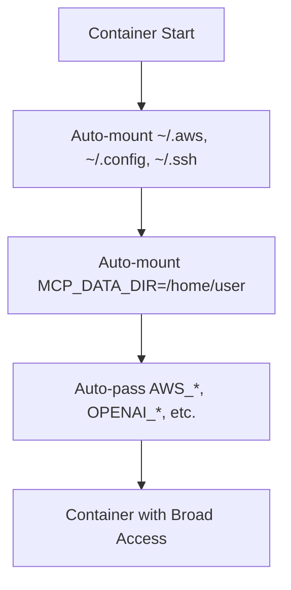
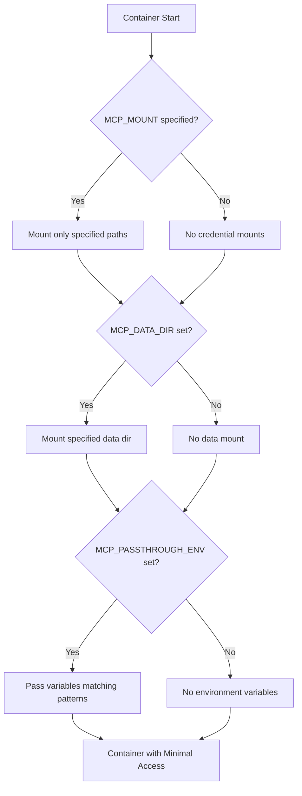
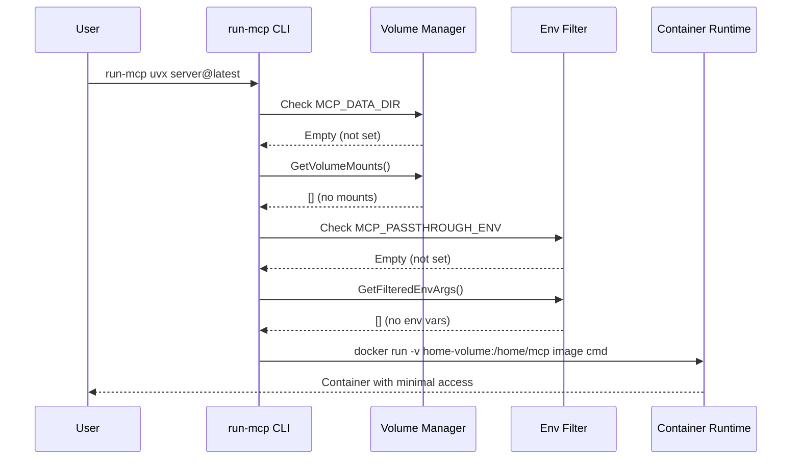
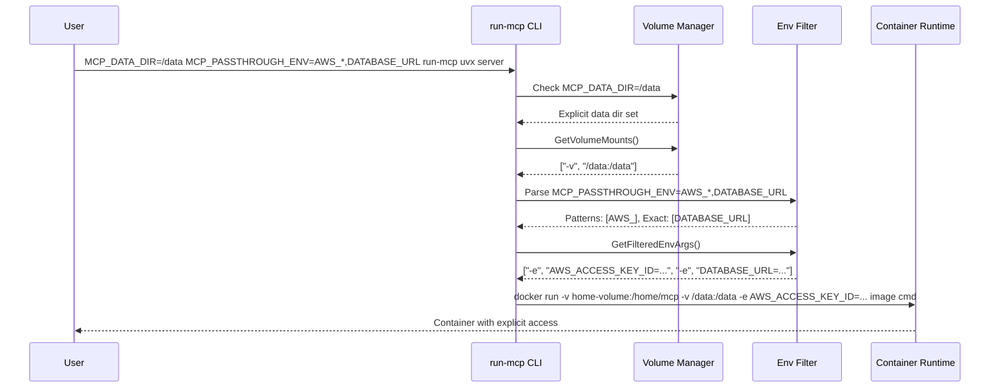

# Design Document: Remove Default Credential Mounts

## Overview

This design implements a secure-by-default approach for run-mcp by removing automatic mounting of host credential directories and data directories, while adding wildcard support to the existing `MCP_PASSTHROUGH_ENV` mechanism. The changes ensure that containers have minimal host access unless explicitly configured by users, following the principle of least privilege.

The design addresses three main security concerns:
1. Automatic mounting of credential directories (`.aws`, `.config`, `.ssh`, and `~/Library/Keychains` on macOS)
2. Automatic mounting of data directories when `MCP_DATA_DIR` defaults to home directory
3. Hardcoded environment variable prefixes that automatically expose sensitive variables

## Architecture

### Current vs. Proposed Architecture

**Current (Insecure) Flow:**


**Proposed (Secure) Flow:**


## Components and Interfaces

### Modified VolumeManager

The `VolumeManager` will be simplified by removing automatic credential mounting:

```go
// Modified GetVolumeMounts method - now secure by default
func (vm *VolumeManager) GetVolumeMounts() []string {
    var mounts []string
    
    // Only mount data directory if explicitly configured
    dataMount := vm.getDataMount()
    if dataMount != "" {
        mounts = append(mounts, "-v", dataMount)
    }
    
    // No automatic credential mounts - removed getCredentialMounts() call
    
    return mounts
}

// Modified getDataMount - only mount when explicitly set
func (vm *VolumeManager) getDataMount() string {
    dataDir := vm.config.DataDir
    
    // Only mount if MCP_DATA_DIR is explicitly set (not defaulted to home)
    if dataDir == "" || vm.isDefaultHomeDir(dataDir) {
        return ""
    }
    
    // Normalize path for cross-platform compatibility
    dataDir = vm.normalizePath(dataDir)
    
    return fmt.Sprintf("%s:/data", dataDir)
}

// New helper method to detect if data dir is the default home directory
func (vm *VolumeManager) isDefaultHomeDir(dataDir string) bool {
    homeDir, err := os.UserHomeDir()
    if err != nil {
        return false
    }
    
    // Normalize both paths for comparison
    normalizedDataDir := vm.normalizePath(dataDir)
    normalizedHomeDir := vm.normalizePath(homeDir)
    
    return normalizedDataDir == normalizedHomeDir
}

// Remove these methods entirely:
// - getCredentialMounts() 
// - getPlatformSpecificMounts()
```

### Enhanced EnvFilter with Wildcard Support

The `EnvFilter` will be updated to support wildcards and remove hardcoded prefixes:

```go
// Modified EnvFilter - secure by default
type EnvFilter struct {
    // Remove allowedPrefixes field entirely
    allowedExact    map[string]bool
    allowedPatterns []string // New field for wildcard patterns
}

// Updated NewEnvFilter - no hardcoded defaults
func NewEnvFilter() *EnvFilter {
    return &EnvFilter{
        allowedExact:    make(map[string]bool), // Empty by default
        allowedPatterns: []string{},            // Empty by default
    }
}

// Enhanced getCustomPassthroughVars with wildcard support
func (ef *EnvFilter) getCustomPassthroughVars() ([]string, []string) {
    var exactVars []string
    var patterns []string
    
    if extra := os.Getenv("MCP_PASSTHROUGH_ENV"); extra != "" {
        for _, v := range strings.Split(extra, ",") {
            v = strings.TrimSpace(v)
            if v != "" {
                if strings.HasSuffix(v, "*") {
                    // Wildcard pattern
                    patterns = append(patterns, strings.TrimSuffix(v, "*"))
                } else {
                    // Exact match
                    exactVars = append(exactVars, v)
                }
            }
        }
    }
    
    return exactVars, patterns
}

// Updated shouldPassthrough with wildcard support
func (ef *EnvFilter) shouldPassthrough(key string) bool {
    // Exclude run-mcp configuration variables
    configVars := []string{
        "MCP_MOUNT",
        "MCP_BIND_HOME", 
        "MCP_HOME_PATH",
        "MCP_PASSTHROUGH_ENV", // Also exclude this from passthrough
    }
    
    for _, configVar := range configVars {
        if key == configVar {
            return false
        }
    }
    
    // Check exact match
    if ef.allowedExact[key] {
        return true
    }
    
    // Check wildcard patterns
    for _, pattern := range ef.allowedPatterns {
        if strings.HasPrefix(key, pattern) {
            return true
        }
    }
    
    return false
}

// Updated GetFilteredEnvArgs with new wildcard logic
func (ef *EnvFilter) GetFilteredEnvArgs() []string {
    var args []string
    seen := make(map[string]bool)
    
    // Parse MCP_PASSTHROUGH_ENV for exact vars and patterns
    exactVars, patterns := ef.getCustomPassthroughVars()
    
    // Add exact variables to allowlist
    for _, v := range exactVars {
        ef.allowedExact[v] = true
    }
    
    // Store patterns for prefix matching
    ef.allowedPatterns = patterns
    
    for _, env := range os.Environ() {
        parts := strings.SplitN(env, "=", 2)
        if len(parts) != 2 {
            continue
        }
        key := parts[0]
        
        if seen[key] {
            continue
        }
        
        if ef.shouldPassthrough(key) {
            args = append(args, "-e", env)
            seen[key] = true
        }
    }
    
    return args
}
```

### Updated Configuration

The `Config` struct will be updated to handle the new secure defaults:

```go
// Updated loadConfig with secure defaults
func loadConfig() *Config {
    // Don't default MCP_DATA_DIR to home directory
    dataDir := os.Getenv("MCP_DATA_DIR") // Only use if explicitly set
    
    config := &Config{
        NodejsImage:      getEnvWithDefault("MCP_NODEJS_IMAGE", "ghcr.io/serverless-dna/run-mcp-nodejs:latest"),
        PythonImage:      getEnvWithDefault("MCP_PYTHON_IMAGE", "ghcr.io/serverless-dna/run-mcp-python:latest"),
        DataDir:          dataDir, // Empty string if not set
        ContainerRuntime: os.Getenv("MCP_CONTAINER_RUNTIME"),
        MaxVolumeSize:    os.Getenv("MCP_MAX_VOLUME_SIZE"),
        SignalConfig:     LoadSignalConfig(),
    }
    
    return config
}

// Updated validation to handle empty DataDir
func (c *Config) Validate() error {
    // Validate images are specified
    if c.NodejsImage == "" {
        return fmt.Errorf("MCP_NODEJS_IMAGE cannot be empty")
    }
    if c.PythonImage == "" {
        return fmt.Errorf("MCP_PYTHON_IMAGE cannot be empty")
    }
    
    // Only validate data directory if it's set
    if c.DataDir != "" {
        if err := c.validateDataDir(); err != nil {
            return fmt.Errorf("data directory validation failed: %w", err)
        }
    }
    
    return nil
}
```

## Data Models

### Centralized MCP Environment Variables

All MCP environment variables are now centrally defined in `cmd/run-mcp/env_constants.go` for consistency and maintainability. The complete list includes:

#### Container Configuration
- `MCP_NODEJS_IMAGE` - Container image for Node.js runtime
- `MCP_PYTHON_IMAGE` - Container image for Python runtime  
- `MCP_CONTAINER_RUNTIME` - Override for container runtime detection

#### Data and Volume Configuration
- `MCP_DATA_DIR` - Data directory to mount at /data
- `MCP_MOUNT` - User-specified bind mounts
- `MCP_BIND_HOME` - Use host directory instead of container volume for home
- `MCP_HOME_PATH` - Custom path for container home directory
- `MCP_MAX_VOLUME_SIZE` - Maximum volume size for storage warnings

#### Environment Variable Configuration
- `MCP_PASSTHROUGH_ENV` - Environment variables to pass through to container

#### Signal and Process Configuration
- `MCP_SIGNAL_TIMEOUT` - Timeout for signal handling

#### Debug and Logging
- `MCP_DEBUG` - Enable debug logging

The centralized constants file provides:
- `AllMCPEnvVars()` - Returns all MCP environment variable names
- `MCPEnvVarDescriptions()` - Returns descriptions for documentation
- `ConfigurationMCPEnvVars()` - Returns variables consumed by run-mcp (not passed to containers)
- `ContainerMCPEnvVars()` - Returns variables that may be passed to containers
- `IsConfigurationEnvVar()` - Checks if a variable should not be passed to containers

### Updated MountInfo

The `MountInfo` struct will be simplified to remove credential mount information:

```go
// Simplified MountInfo - no credential mounts
type MountInfo struct {
    DataMount string // Only present if MCP_DATA_DIR is explicitly set
    // Remove CredentialMounts field entirely
}

// Updated GetMountInfo method
func (vm *VolumeManager) GetMountInfo() MountInfo {
    info := MountInfo{
        DataMount: vm.getDataMount(),
    }
    
    // No credential mount detection
    
    return info
}
```

### Environment Variable Configuration

New structures to support wildcard patterns:

```go
// New structure for environment variable configuration
type EnvConfig struct {
    ExactVars []string `json:"exact_vars"`
    Patterns  []string `json:"patterns"`
}

// Helper function to parse MCP_PASSTHROUGH_ENV
func ParsePassthroughEnv(envValue string) EnvConfig {
    config := EnvConfig{
        ExactVars: []string{},
        Patterns:  []string{},
    }
    
    if envValue == "" {
        return config
    }
    
    for _, v := range strings.Split(envValue, ",") {
        v = strings.TrimSpace(v)
        if v != "" {
            if strings.HasSuffix(v, "*") {
                config.Patterns = append(config.Patterns, strings.TrimSuffix(v, "*"))
            } else {
                config.ExactVars = append(config.ExactVars, v)
            }
        }
    }
    
    return config
}
```

## Implementation Flow

### Secure Container Startup Flow



### Explicit Configuration Flow



## Migration Strategy

### Backward Compatibility Impact

This is a **breaking change** that improves security but may affect existing users:

**What breaks:**
- Containers that relied on automatic credential mounting will lose access to `.aws`, `.config`, `.ssh`, and `~/Library/Keychains` (macOS)
- Containers that relied on automatic data directory mounting will lose access to `/data`
- Containers that relied on hardcoded environment variable prefixes will lose those variables

**Migration path:**
1. **For credential access:** Use `MCP_MOUNT=~/.aws:/home/mcp/.aws:ro,~/.ssh:/home/mcp/.ssh:ro` (or `~/Library/Keychains:/home/mcp/Library/Keychains:ro` on macOS)
2. **For data access:** Set `MCP_DATA_DIR=/path/to/data` explicitly
3. **For environment variables:** Use `MCP_PASSTHROUGH_ENV=AWS_*,OPENAI_*,DATABASE_URL`

### Migration Documentation

```bash
# Before (automatic, insecure)
run-mcp uvx awslabs.aws-api-mcp-server@latest

# After (explicit, secure)
MCP_DATA_DIR=~/data \
MCP_MOUNT=~/.aws:/home/mcp/.aws:ro \
MCP_PASSTHROUGH_ENV=AWS_* \
run-mcp uvx awslabs.aws-api-mcp-server@latest
```

## Error Handling

### Enhanced Error Messages

When containers fail due to missing credentials or data access:

```go
// Enhanced error handling for missing credentials
func (eh *ErrorHandler) HandleMissingCredentials(err error, serverType string) error {
    baseMsg := fmt.Sprintf("Container failed: %v", err)
    
    suggestions := []string{
        "This may be due to missing credential access.",
        "",
        "To grant credential access, use:",
        "  MCP_MOUNT=~/.aws:/home/mcp/.aws:ro  # For AWS credentials",
        "  MCP_MOUNT=~/.ssh:/home/mcp/.ssh:ro  # For SSH keys",
        "",
        "To pass environment variables, use:",
        "  MCP_PASSTHROUGH_ENV=AWS_*,OPENAI_*  # For API keys",
        "",
        "For data access, set:",
        "  MCP_DATA_DIR=/path/to/data  # Mounts at /data in container",
    }
    
    return fmt.Errorf("%s\n\n%s", baseMsg, strings.Join(suggestions, "\n"))
}
```

## Testing Strategy

*A property is a characteristic or behavior that should hold true across all valid executions of a system—essentially, a formal statement about what the system should do. Properties serve as the bridge between human-readable specifications and machine-verifiable correctness guarantees.*

### Correctness Properties

Based on the requirements analysis, the following correctness properties must hold:

### Property 1: Secure Default Container Access
*For any* container started with default configuration (no explicit mounts, data dir, or env vars), the container should have access only to its home volume and no host credential directories, data directories, or environment variables.
**Validates: Requirements 1.1, 1.6, 8.1, 8.3, 9.1, 9.3**

### Property 2: Home Volume Preservation
*For any* container startup, the home volume should always be mounted at `/home/mcp` with read/write permissions, regardless of other mount configurations.
**Validates: Requirements 2.1, 2.2**

### Property 3: Explicit Mount Functionality
*For any* valid `MCP_MOUNT` specification, the system should mount exactly the specified paths with the specified options and no additional automatic mounts.
**Validates: Requirements 3.1, 3.3, 6.3**

### Property 4: Explicit Data Directory Mounting
*For any* explicitly set `MCP_DATA_DIR` value, the system should mount that directory at `/data` in the container and validate its accessibility.
**Validates: Requirements 4.1, 4.3, 8.2**

### Property 5: Wildcard Environment Variable Matching
*For any* `MCP_PASSTHROUGH_ENV` value containing wildcard patterns (e.g., `AWS_*,DATABASE_URL`), the system should pass through all environment variables matching those patterns and exact names, and no others.
**Validates: Requirements 9.2, 9.6**

### Property 6: Configuration Variable Exclusion
*For any* environment variable that is a run-mcp configuration variable (`MCP_MOUNT`, `MCP_BIND_HOME`, `MCP_PASSTHROUGH_ENV`, etc.), the system should never pass it to the container regardless of passthrough configuration.
**Validates: Requirements 9.4**

### Property 7: Ephemeral Volume Support
*For any* container started with the `--ephemeral` flag, the system should create a unique ephemeral volume that is cleaned up when the container stops.
**Validates: Requirements 2.4**

### Property 8: Credential Access Requires Explicit Configuration
*For any* container that needs credential access, the system should only provide it when explicitly configured via `MCP_MOUNT`, and should provide clear error messages when access is needed but not configured.
**Validates: Requirements 3.5, 6.2, 6.5**

### Property 9: Removed Method Functionality
*For any* attempt to call removed methods (`getCredentialMounts()`, `getPlatformSpecificMounts()`), the system should not have these methods available, and `GetMountInfo()` should not include credential mount information.
**Validates: Requirements 7.1, 7.2, 7.3, 7.4**

### Property 10: Backward Compatibility for Non-Credential Users
*For any* MCP server that doesn't require credential access, the system should continue to work without any configuration changes.
**Validates: Requirements 6.1**

### Unit Testing Focus Areas

Unit tests will complement property tests by focusing on:

- **Wildcard pattern parsing**: Edge cases in `MCP_PASSTHROUGH_ENV` parsing
- **Path normalization**: Cross-platform path handling for mount detection
- **Error message generation**: Clear guidance for users missing access
- **Configuration validation**: Handling of empty vs. unset values
- **Mount argument generation**: Correct Docker/Podman argument formatting

### Testing Implementation

Property-based tests will use Go's testing framework with randomized inputs:

```go
// Feature: remove-default-credential-mounts, Property 1: No Automatic Credential Mounting
func TestProperty1_NoAutomaticCredentialMounting(t *testing.T) {
    property := func(serverCmd []string) bool {
        // Start container with no MCP_MOUNT configuration
        os.Unsetenv("MCP_MOUNT")
        
        vm := NewVolumeManager(&Config{})
        mounts := vm.GetVolumeMounts()
        
        // Verify no credential directories are mounted
        for _, mount := range mounts {
            if strings.Contains(mount, ".aws") || 
               strings.Contains(mount, ".config") || 
               strings.Contains(mount, ".ssh") {
                return false
            }
        }
        return true
    }
    
    if err := quick.Check(property, &quick.Config{MaxCount: 100}); err != nil {
        t.Error(err)
    }
}
```

## Security Considerations

### Threat Model

**Before (Vulnerable):**
- MCP servers have automatic access to AWS credentials, SSH keys, config files, and Keychain (macOS)
- Servers can read/write entire user home directory via `/data` mount
- Sensitive environment variables automatically exposed

**After (Secure):**
- MCP servers have no host access by default
- Users must explicitly grant specific access
- Principle of least privilege enforced

### Defense in Depth

1. **No automatic mounts**: Containers start with minimal access
2. **Explicit configuration required**: Users must consciously grant access
3. **Wildcard patterns**: Fine-grained control over environment variables
4. **Clear error messages**: Guide users to secure configuration practices

## Performance Considerations

### Startup Performance

- **Improved**: Fewer filesystem checks (no credential directory detection)
- **Improved**: Fewer mount operations by default
- **Minimal impact**: Wildcard pattern matching is O(n) where n is number of env vars

### Memory Usage

- **Reduced**: Smaller data structures (no hardcoded prefix lists)
- **Reduced**: Less mount metadata tracking

### Compatibility

- **Breaking change**: Requires user action for credential/data access
- **Migration effort**: Users need to update configurations
- **Long-term benefit**: More secure and predictable behavior

## Documentation Updates

### Updated Examples

```bash
# Minimal (secure by default)
run-mcp npx @modelcontextprotocol/server-memory

# With AWS credentials (explicit)
MCP_MOUNT=~/.aws:/home/mcp/.aws:ro \
MCP_PASSTHROUGH_ENV=AWS_* \
run-mcp uvx awslabs.aws-api-mcp-server@latest

# With data access (explicit)
MCP_DATA_DIR=~/projects/myproject \
run-mcp uvx mcp-server-sqlite --db-path /data/db.sqlite

# Complex configuration (explicit)
MCP_DATA_DIR=~/data \
MCP_MOUNT=~/.aws:/home/mcp/.aws:ro,~/.ssh:/home/mcp/.ssh:ro \
MCP_PASSTHROUGH_ENV=AWS_*,GITHUB_TOKEN,DATABASE_URL \
run-mcp uvx my-complex-server
```

### Migration Guide

The documentation will include a comprehensive migration guide showing:
1. How to identify what access your MCP servers need
2. How to convert automatic access to explicit configuration
3. Common configuration patterns for different server types
4. Troubleshooting guide for access-related errors