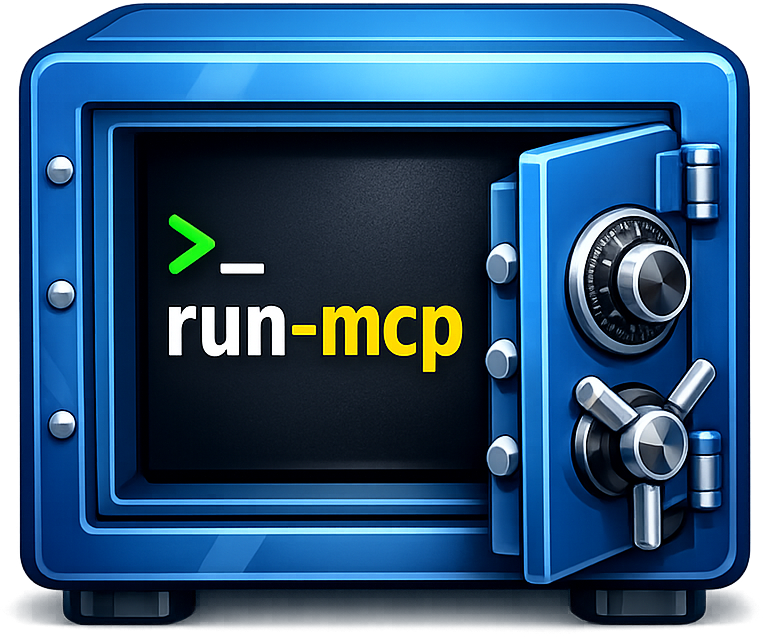

# run-mcp



Run MCP servers securely in containers with one config change.

## The Problem

MCP servers run with your full user permissions. SSH keys, AWS credentials, browser cookies — all visible to any MCP server you install.

## The Solution

One word change. Full container isolation.

**Before:**
```json
{
  "mcpServers": {
    "sqlite": {
      "command": "uvx",
      "args": [
        "mcp-server-sqlite", 
        "--db-path", 
        "~/data/mydb.sqlite"]
    }
  }
}
```

**After:**
```json
{
  "mcpServers": {
    "sqlite": {
      "command": "run-mcp",
      "args": [
        "uvx", 
        "mcp-server-sqlite", 
        "--db-path", 
        "/data/mydb.sqlite"
      ],
      "env": {
        "MCP_DATA_DIR": "~/data"
      }
    }
  }
}
```

The server runs in a container with zero access to your host — unless you explicitly grant it.

## Install

**macOS / Linux (Homebrew)**
```bash
brew tap serverless-dna/tap
brew install run-mcp
```

**Windows (PowerShell)**
```powershell
irm https://raw.githubusercontent.com/serverless-dna/run-mcp/main/install/win-installer.ps1 | iex
```

**Linux (curl)**
```bash
curl -fsSL https://raw.githubusercontent.com/serverless-dna/run-mcp/main/install/install.sh | sh
```

## Quick Start

1. Install run-mcp (see above)
2. Ensure Docker or Podman container runtime is running
3. Update your Claude Desktop config:

```json
{
  "mcpServers": {
    "memory": {
      "command": "run-mcp",
      "args": ["npx", "@modelcontextprotocol/server-memory"]
    }
  }
}
```

4. Restart Claude Desktop

That's it. The server runs in complete isolation.

## Examples

**Read-only filesystem access:**
```json
{
  "command": "run-mcp",
  "args": ["npx", "@modelcontextprotocol/server-filesystem", "/docs"],
  "env": {
    "MCP_MOUNT": "~/Documents:/docs:ro"
  }
}
```

**AWS credentials (read-only):**
```json
{
  "command": "run-mcp",
  "args": ["uvx", "awslabs.aws-api-mcp-server"],
  "env": {
    "MCP_MOUNT": "~/.aws:/home/mcp/.aws:ro",
    "AWS_REGION": "us-east-1"
  }
}
```

See [docs/examples.md](./docs/examples.md) for more.

## Documentation

- [Configuration Guide](./docs/configuration.md) — Environment variables and options
- [Mount Options](./docs/mounts.md) — Controlling filesystem access
- [Container Images](./docs/images.md) — Supported runtimes and versions
- [Examples](./docs/examples.md) — Common MCP server configurations
- [Troubleshooting](./docs/troubleshooting.md) — Common issues and fixes
- [Development](./docs/development.md) — Building and contributing

## How It Works

1. Replace `uvx` or `npx` with `run-mcp`
2. Add the original command as the first argument
3. Use `MCP_DATA_DIR` to grant explicit filesystem access

run-mcp auto-detects your container runtime (Docker, Podman) and runs the MCP server in an isolated container. No Docker knowledge required.

## Requirements

- A container runtime: Docker, Podman, or compatible
- That's it

## License

MIT

## Links

- [Blog Post](https://serverlessdna.com/projects/run-mcp)
- [Container Images](https://github.com/orgs/serverless-dna/packages)